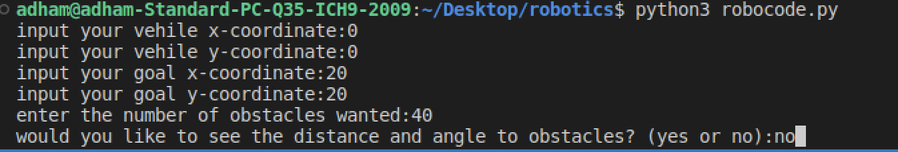
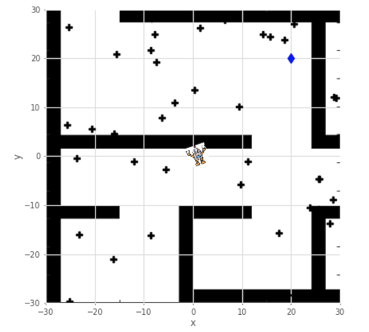
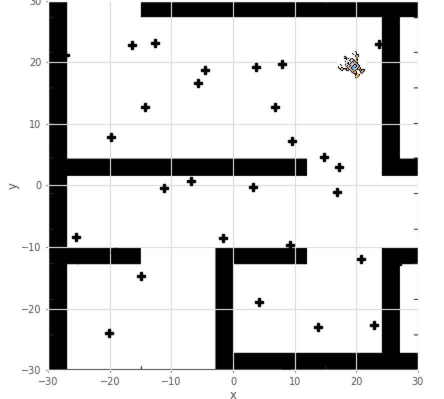
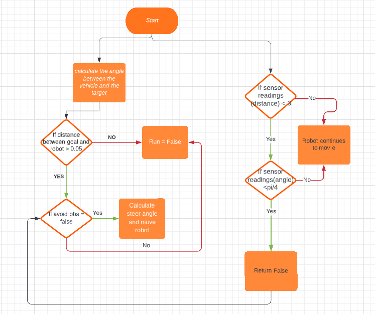
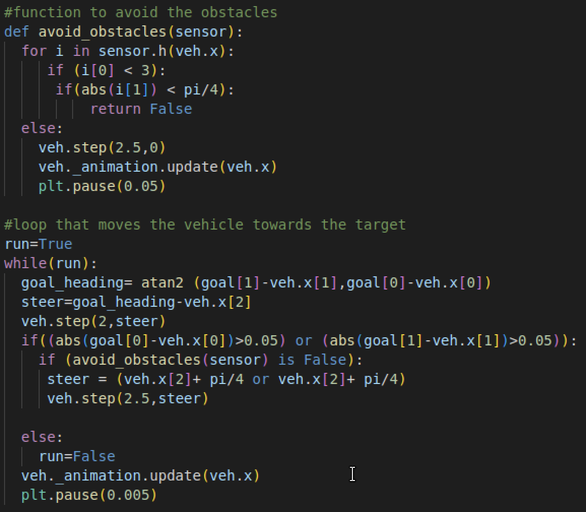
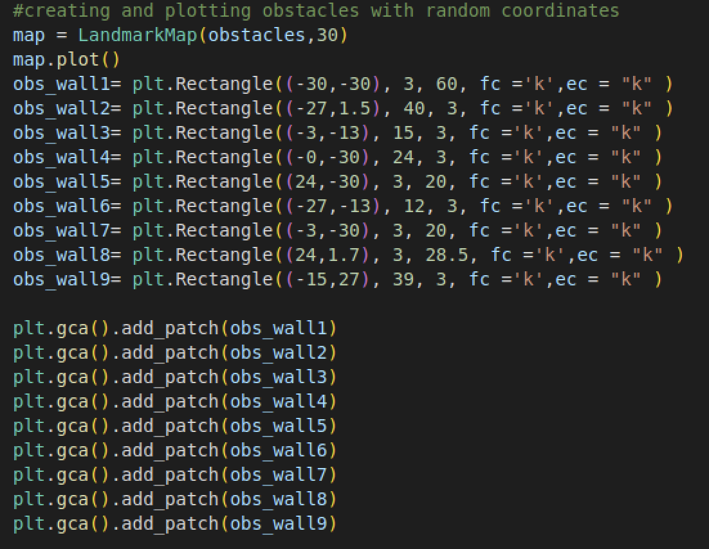

# RoboProject Documentation
Contributors: Adham Saad, Youssef El Shershaby, Mohamed Gadallah
## Introduction
The aim of this project is to provide autonomous navigation for a robot to reach it's target, while avoiding obstacle and the walls of the map. The python version used was python 3.6

## Libraries Imported
- roboticstoolbox
- matplotlib.pyplot
- matplotlib.image
- math
- numpy

## User Inputs
- Coordinates of the robot.
- Coordinates of the target.
- Number of obstacles.
- Decision to show distance and angle to target

## Output
The terminal output that the user views, asks for the user to input the vehicle intial position, the target coordinates, the number of obstacles desired and whether he would like to view the sensor readings(distance and angle from the vehicle to each obstacle) or not.

The output after the user inputs shows the robot icon at the coordinates chosen.

The end result is as expected where the robot icon reaches the target while avoiding all obstacles.

## Methodology
The movement code is desired to satisfy two main task:
### Movement to target
To achieve this we make use of the atan2 function from the math library named goal_heading in our code, which helps with calculating the angle of target from the robot. To reach the target we umake use of goal heading by moving the robot using veh.step which is a function in the robotics toolbox which needs two arguments, the speed and an angle. The angle in the step is uses the goal_heading which makes the robot move towards the target with a steady speed and with an angle that ensures it reaching the target. Once it reaches the target, the robot stops. 
### Avoid obstacles
To avoid obstacles a function was defined and named as Avoid_obstacles. This function uses the readings of the sensor which gives the distance and the angle between the robot and the obstacle. The loops used basically check if the distance between them is lesser than 3 and the angle is lesser than pi/4 and then returns false, if not it keeps moving towards the target normally. If false is returned, it is used in the movement where the robot has a steering angle of pi/4.
### Overall Functionality
- The user inputs the target and the robot coordinates and the number of obstacles.
- The sensor calculates distance and angle between robot and obstacles.
- Goal_heading calculates angle between robot and target.
- Robot gets a steady speed of 2 and an angle = Goal_heading.
- If the distance between the robot and the obstacle is lesser than 3 it checks if the angle is lesser than pi/4 and if so it gives a steering angle to the veh.step function of pi/4.
- Robot steers away from obstacles and stops at the target coordinates.

'''
#function to avoid the obstacles
def avoid_obstacles(sensor):
  for i in sensor.h(veh.x):
     if (i[0] < 3):
      if(abs(i[1]) < pi/4):
          return False
  else:
    veh.step(2.5,0)
    veh._animation.update(veh.x)
    plt.pause(0.05)

#loop that moves the vehicle towards the target 
run=True
while(run):
  goal_heading= atan2 (goal[1]-veh.x[1],goal[0]-veh.x[0])
  steer=goal_heading-veh.x[2]
  veh.step(2,steer)
  if((abs(goal[0]-veh.x[0])>0.05) or (abs(goal[1]-veh.x[1])>0.05)):
    if (avoid_obstacles(sensor) is False):
     steer = (veh.x[2]+ pi/4 or veh.x[2]+ pi/4)
     veh.step(2.5,steer)
  else:
    run=False
  veh._animation.update(veh.x)
  plt.pause(0.005)
'''

## Limitations and further Improvement
Our code runs perfectly and the algorithm to avoid the obstacle and reach the target works smoothly. However, we could not execute the algorithem to make the robot avoid the walls of the maze correctly. We had two approaches in mind, One is to make a list of the walls coordinates and make the robot avoid those coordinates but we got an error stating that the list is too ambigous. The second approach was to create rectangular blocks that cover the walls of the maze but we could not comprehend how to make a comparison between the vehicle coordinates and the coordinates of said blocks. Another small problem that was noticed is if there is an obstacle within a distance of 3 from the target, this causes the robot to spin around itself at the target because it is instructed to stop when reaching the target but at the same time constructed to steer away if it is within a range of distance 3 from an obstacle.

## Contribution towards the code
Unfortunately we all had a problem with commiting the changes in the code from ubuntu. Therefore, we uploaded our file after it was finished on github.

We created a list of contributions as we have been told by Doctor Khaled Geneidy.

- Mohammed Adel: worked on initialising the vehicle icon, the target icon, user inputs and the sesnor reading algorithm.
- Adham Saad: Worked on reaching the target algorithm and avoiding obstacles.
- Yousef Mamdouh: Worked on reaching the target algorithm and avoiding obstacles.

