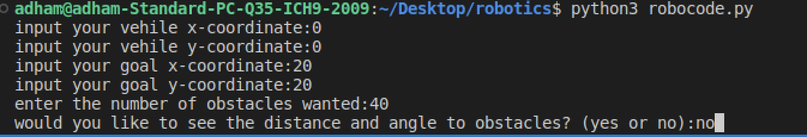

# RoboProject Documentation
Contributors: Adham Saad, Youssef El Shershaby, Mohamed Gadallah
## Introduction
The aim of this project is to provide autonomous navigation for a robot to reach it's target, while avoiding obstacle and the walls of the map. The python version used was python 3.6

## Libraries Imported
- roboticstoolbox
- matplotlib.pyplot
- matplotlib.image
- math
- numpy

## User Inputs
- Coordinates of the robot.
- Coordinates of the target.
- Number of obstacles.
- Decision to show distance and angle to target

## Output
The terminal output that the user views, asks for the user to input the vehicle intial position, the target coordinates, the number of obstacles desired and whether he would like to view the sensor readings(distance and angle from the vehicle to each obstacle) or not.

The output after the user inputs shows the robot icon at the coordinates chosen.

The end result is as expected where the robot icon reaches the target while avoiding all obstacles.

## Methodology

